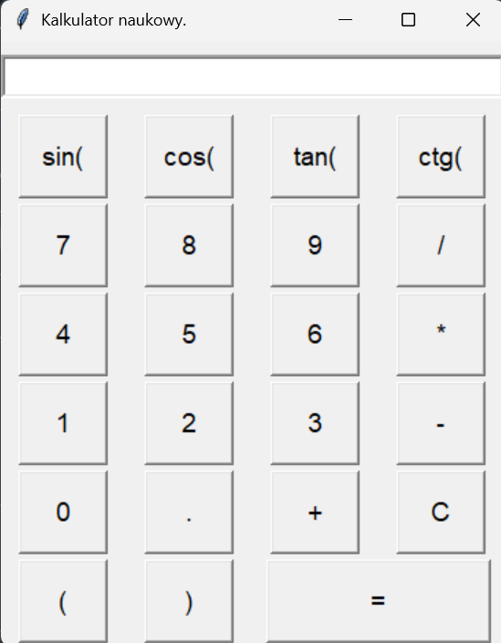
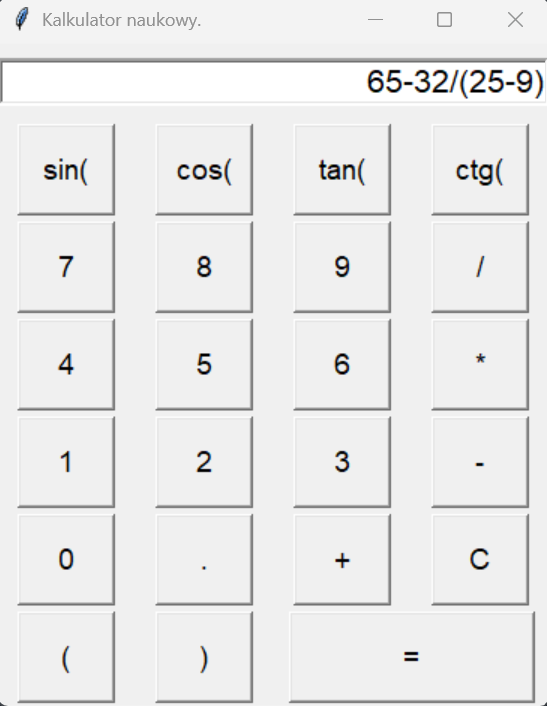

# Kalkulator naukowy w Pythonie

Prosty kalkulator naukowy z GUI w Tkinter, umożliwiający działania arytmetyczne i funkcje trygonometryczne (sin, cos, tan, ctg).

Przykładowy wygląd aplikacji:

Przykład działania (wyrażenie z nawiasami, złożone obliczenie):

## Funkcje:
- Działania podstawowe: +, -, *, /
- Obsługa nawiasów i kolejności działań (dzięki py_expression_eval)
- Funkcje trygonometryczne: sin, cos, tan, ctg (argument w stopniach)
- Przejrzysty interfejs w Tkinter

## Technologie

Python 3.9
Tkinter
py_expression_eval
math (wbudowana biblioteka Pythona)

## Jak uruchomić?

1. Zainstaluj wymagane biblioteki:

pip install py_expression_eval

2. Uruchom plik:

python kalkulator.py

## Autor
Projekt portfolio by Jakub